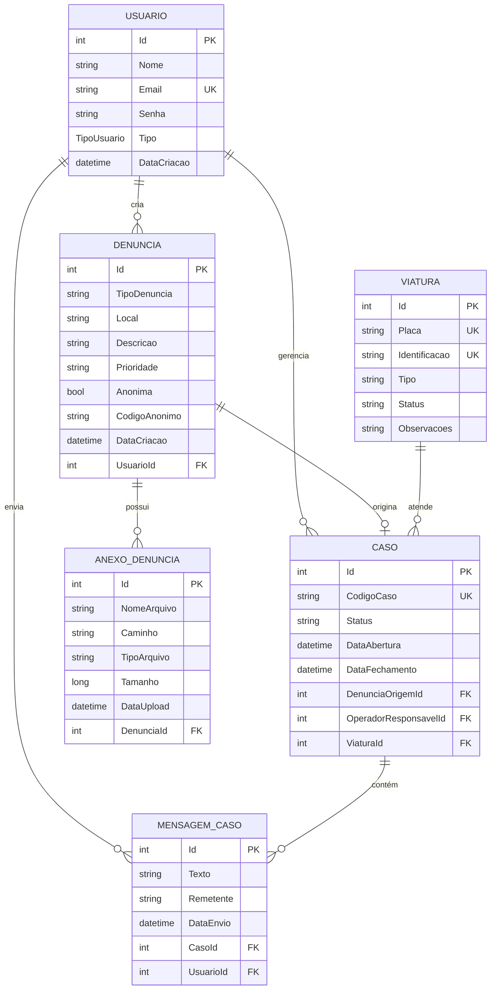

# 🗄️ Diagrama do Banco de Dados

## Modelo Entidade-Relacionamento

---

## 📋 Descrição das Entidades

| Entidade | Descrição |
|----------|-----------|
| **Usuario** | Cidadãos, operadores e administradores do sistema |
| **Denuncia** | Denúncias criadas pelos cidadãos |
| **Caso** | Casos abertos a partir de denúncias promovidas |
| **MensagemCaso** | Mensagens do chat entre operador e denunciante |
| **AnexoDenuncia** | Arquivos anexados às denúncias |
| **Viatura** | Viaturas disponíveis para atendimento |

---

## 🔗 Relacionamentos

| Relação | Cardinalidade | Descrição |
|---------|---------------|-----------|
| Usuario → Denuncia | 1:N | Um usuário pode criar várias denúncias |
| Usuario → Caso | 1:N | Um operador gerencia vários casos |
| Denuncia → Caso | 1:1 | Uma denúncia pode originar um caso |
| Denuncia → Anexo | 1:N | Uma denúncia pode ter vários anexos |
| Caso → Mensagem | 1:N | Um caso pode ter várias mensagens |
| Viatura → Caso | 1:N | Uma viatura pode atender vários casos |

---

## 📊 Tipos Enumerados

### TipoUsuario
- `Cidadao` (0)
- `Operador` (1)
- `Administrador` (2)

### Status do Caso
- `aberto`
- `em_andamento`
- `resolvido`
- `fechado`

### Status da Viatura
- `Disponível`
- `Em Atendimento`
- `Manutenção`
- `Inativa`
