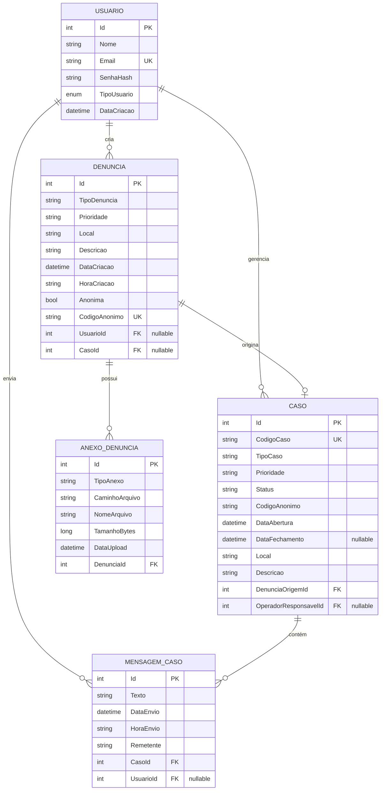
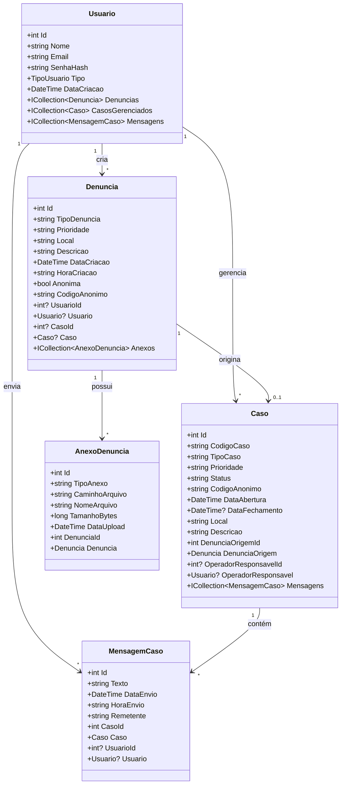

# 🗄️ Diagrama de Entidades do Banco de Dados

## Modelo Entidade-Relacionamento (ER)



---

## Tabelas Detalhadas

### 1. **USUARIO**

| Coluna | Tipo | Constraints | Descrição |
|--------|------|-------------|-----------|
| Id | INT | PK, AUTO_INCREMENT | Identificador único |
| Nome | VARCHAR(100) | NOT NULL | Nome completo |
| Email | VARCHAR(255) | NOT NULL, UNIQUE | Email único |
| SenhaHash | VARCHAR(255) | NOT NULL | Senha criptografada (BCrypt) |
| TipoUsuario | ENUM | NOT NULL | 0=Cidadão, 1=Operador, 2=Admin |
| DataCriacao | DATETIME | DEFAULT NOW() | Data de cadastro |

**Índices:**
- PRIMARY KEY (Id)
- UNIQUE INDEX (Email)
- INDEX (TipoUsuario)

---

### 2. **DENUNCIA**

| Coluna | Tipo | Constraints | Descrição |
|--------|------|-------------|-----------|
| Id | INT | PK, AUTO_INCREMENT | Identificador único |
| TipoDenuncia | VARCHAR(50) | NOT NULL | violencia, furto, trafico, etc |
| Prioridade | VARCHAR(20) | NOT NULL | alta, media, baixa |
| Local | VARCHAR(255) | NOT NULL | Endereço/localização |
| Descricao | TEXT | NOT NULL | Descrição detalhada |
| DataCriacao | DATETIME | DEFAULT NOW() | Data de criação |
| HoraCriacao | VARCHAR(10) | NOT NULL | Hora formatada (HH:mm) |
| Anonima | BOOLEAN | DEFAULT FALSE | Se é anônima |
| CodigoAnonimo | VARCHAR(50) | UNIQUE | Código de acompanhamento |
| UsuarioId | INT | FK, NULLABLE | Referência ao usuário (null se anônima) |
| CasoId | INT | FK, NULLABLE | Referência ao caso (null se não promovida) |

**Índices:**
- PRIMARY KEY (Id)
- UNIQUE INDEX (CodigoAnonimo)
- INDEX (UsuarioId)
- INDEX (CasoId)
- INDEX (TipoDenuncia)
- INDEX (Prioridade)
- INDEX (DataCriacao)

**Relacionamentos:**
- FOREIGN KEY (UsuarioId) REFERENCES USUARIO(Id) ON DELETE SET NULL
- FOREIGN KEY (CasoId) REFERENCES CASO(Id) ON DELETE SET NULL

---

### 3. **CASO**

| Coluna | Tipo | Constraints | Descrição |
|--------|------|-------------|-----------|
| Id | INT | PK, AUTO_INCREMENT | Identificador único |
| CodigoCaso | VARCHAR(50) | NOT NULL, UNIQUE | Ex: CASO001, CASO002 |
| TipoCaso | VARCHAR(50) | NOT NULL | Tipo herdado da denúncia |
| Prioridade | VARCHAR(20) | NOT NULL | alta, media, baixa |
| Status | VARCHAR(30) | NOT NULL | aberto, em_andamento, resolvido, fechado |
| CodigoAnonimo | VARCHAR(50) | NOT NULL | Código do denunciante |
| DataAbertura | DATETIME | DEFAULT NOW() | Data de abertura |
| DataFechamento | DATETIME | NULLABLE | Data de fechamento |
| Local | VARCHAR(255) | NOT NULL | Local da ocorrência |
| Descricao | TEXT | NOT NULL | Descrição do caso |
| DenunciaOrigemId | INT | FK, NOT NULL | Denúncia que originou |
| OperadorResponsavelId | INT | FK, NULLABLE | Operador responsável |

**Índices:**
- PRIMARY KEY (Id)
- UNIQUE INDEX (CodigoCaso)
- INDEX (DenunciaOrigemId)
- INDEX (OperadorResponsavelId)
- INDEX (Status)
- INDEX (DataAbertura)

**Relacionamentos:**
- FOREIGN KEY (DenunciaOrigemId) REFERENCES DENUNCIA(Id) ON DELETE CASCADE
- FOREIGN KEY (OperadorResponsavelId) REFERENCES USUARIO(Id) ON DELETE SET NULL

---

### 4. **MENSAGEM_CASO**

| Coluna | Tipo | Constraints | Descrição |
|--------|------|-------------|-----------|
| Id | INT | PK, AUTO_INCREMENT | Identificador único |
| Texto | TEXT | NOT NULL | Conteúdo da mensagem |
| DataEnvio | DATETIME | DEFAULT NOW() | Data/hora de envio |
| HoraEnvio | VARCHAR(10) | NOT NULL | Hora formatada (HH:mm) |
| Remetente | VARCHAR(20) | NOT NULL | "denunciante" ou "operador" |
| CasoId | INT | FK, NOT NULL | Caso relacionado |
| UsuarioId | INT | FK, NULLABLE | Usuário que enviou |

**Índices:**
- PRIMARY KEY (Id)
- INDEX (CasoId)
- INDEX (UsuarioId)
- INDEX (DataEnvio)

**Relacionamentos:**
- FOREIGN KEY (CasoId) REFERENCES CASO(Id) ON DELETE CASCADE
- FOREIGN KEY (UsuarioId) REFERENCES USUARIO(Id) ON DELETE SET NULL

---

### 5. **ANEXO_DENUNCIA**

| Coluna | Tipo | Constraints | Descrição |
|--------|------|-------------|-----------|
| Id | INT | PK, AUTO_INCREMENT | Identificador único |
| TipoAnexo | VARCHAR(20) | NOT NULL | audio, foto, video |
| CaminhoArquivo | VARCHAR(500) | NOT NULL | Caminho no servidor |
| NomeArquivo | VARCHAR(255) | NOT NULL | Nome original do arquivo |
| TamanhoBytes | BIGINT | NOT NULL | Tamanho em bytes |
| DataUpload | DATETIME | DEFAULT NOW() | Data do upload |
| DenunciaId | INT | FK, NOT NULL | Denúncia relacionada |

**Índices:**
- PRIMARY KEY (Id)
- INDEX (DenunciaId)
- INDEX (TipoAnexo)

**Relacionamentos:**
- FOREIGN KEY (DenunciaId) REFERENCES DENUNCIA(Id) ON DELETE CASCADE

---

## Relacionamentos Detalhados

### 1. USUARIO → DENUNCIA (1:N)
- Um usuário pode criar várias denúncias
- Uma denúncia pode não ter usuário (denúncia anônima)
- **Cardinalidade**: 1:N (opcional)

### 2. USUARIO → CASO (1:N)
- Um operador pode gerenciar vários casos
- Um caso pode não ter operador responsável
- **Cardinalidade**: 1:N (opcional)

### 3. USUARIO → MENSAGEM_CASO (1:N)
- Um usuário pode enviar várias mensagens
- Uma mensagem pode não ter usuário (denúncia anônima)
- **Cardinalidade**: 1:N (opcional)

### 4. DENUNCIA → CASO (1:1)
- Uma denúncia pode originar um caso
- Um caso é originado de uma denúncia
- **Cardinalidade**: 1:1 (opcional)

### 5. DENUNCIA → ANEXO_DENUNCIA (1:N)
- Uma denúncia pode ter vários anexos
- Um anexo pertence a uma denúncia
- **Cardinalidade**: 1:N

### 6. CASO → MENSAGEM_CASO (1:N)
- Um caso pode ter várias mensagens
- Uma mensagem pertence a um caso
- **Cardinalidade**: 1:N

---

## Enums e Valores Permitidos

### TipoUsuario
```csharp
public enum TipoUsuario
{
    Cidadao = 0,
    Operador = 1,
    Administrador = 2
}
```

### TipoDenuncia
- `violencia`
- `furto`
- `trafico`
- `vandalismo`
- `perturbacao`
- `outros`

### Prioridade
- `alta`
- `media`
- `baixa`

### Status (Caso)
- `aberto`
- `em_andamento`
- `resolvido`
- `fechado`

### TipoAnexo
- `audio`
- `foto`
- `video`

### Remetente (Mensagem)
- `denunciante`
- `operador`

---

## Diagrama de Classes (C# Models)



---

## Script SQL de Criação (MySQL)

```sql
-- Tabela de Usuários
CREATE TABLE Usuarios (
    Id INT AUTO_INCREMENT PRIMARY KEY,
    Nome VARCHAR(100) NOT NULL,
    Email VARCHAR(255) NOT NULL UNIQUE,
    SenhaHash VARCHAR(255) NOT NULL,
    TipoUsuario TINYINT NOT NULL DEFAULT 0,
    DataCriacao DATETIME DEFAULT CURRENT_TIMESTAMP,
    INDEX idx_tipo (TipoUsuario),
    INDEX idx_email (Email)
) ENGINE=InnoDB DEFAULT CHARSET=utf8mb4;

-- Tabela de Denúncias
CREATE TABLE Denuncias (
    Id INT AUTO_INCREMENT PRIMARY KEY,
    TipoDenuncia VARCHAR(50) NOT NULL,
    Prioridade VARCHAR(20) NOT NULL,
    Local VARCHAR(255) NOT NULL,
    Descricao TEXT NOT NULL,
    DataCriacao DATETIME DEFAULT CURRENT_TIMESTAMP,
    HoraCriacao VARCHAR(10) NOT NULL,
    Anonima BOOLEAN DEFAULT FALSE,
    CodigoAnonimo VARCHAR(50) UNIQUE,
    UsuarioId INT NULL,
    CasoId INT NULL,
    INDEX idx_usuario (UsuarioId),
    INDEX idx_caso (CasoId),
    INDEX idx_tipo (TipoDenuncia),
    INDEX idx_prioridade (Prioridade),
    INDEX idx_data (DataCriacao),
    FOREIGN KEY (UsuarioId) REFERENCES Usuarios(Id) ON DELETE SET NULL,
    FOREIGN KEY (CasoId) REFERENCES Casos(Id) ON DELETE SET NULL
) ENGINE=InnoDB DEFAULT CHARSET=utf8mb4;

-- Tabela de Casos
CREATE TABLE Casos (
    Id INT AUTO_INCREMENT PRIMARY KEY,
    CodigoCaso VARCHAR(50) NOT NULL UNIQUE,
    TipoCaso VARCHAR(50) NOT NULL,
    Prioridade VARCHAR(20) NOT NULL,
    Status VARCHAR(30) NOT NULL,
    CodigoAnonimo VARCHAR(50) NOT NULL,
    DataAbertura DATETIME DEFAULT CURRENT_TIMESTAMP,
    DataFechamento DATETIME NULL,
    Local VARCHAR(255) NOT NULL,
    Descricao TEXT NOT NULL,
    DenunciaOrigemId INT NOT NULL,
    OperadorResponsavelId INT NULL,
    INDEX idx_codigo (CodigoCaso),
    INDEX idx_status (Status),
    INDEX idx_denuncia (DenunciaOrigemId),
    INDEX idx_operador (OperadorResponsavelId),
    INDEX idx_data_abertura (DataAbertura),
    FOREIGN KEY (DenunciaOrigemId) REFERENCES Denuncias(Id) ON DELETE CASCADE,
    FOREIGN KEY (OperadorResponsavelId) REFERENCES Usuarios(Id) ON DELETE SET NULL
) ENGINE=InnoDB DEFAULT CHARSET=utf8mb4;

-- Tabela de Mensagens
CREATE TABLE MensagensCaso (
    Id INT AUTO_INCREMENT PRIMARY KEY,
    Texto TEXT NOT NULL,
    DataEnvio DATETIME DEFAULT CURRENT_TIMESTAMP,
    HoraEnvio VARCHAR(10) NOT NULL,
    Remetente VARCHAR(20) NOT NULL,
    CasoId INT NOT NULL,
    UsuarioId INT NULL,
    INDEX idx_caso (CasoId),
    INDEX idx_usuario (UsuarioId),
    INDEX idx_data (DataEnvio),
    FOREIGN KEY (CasoId) REFERENCES Casos(Id) ON DELETE CASCADE,
    FOREIGN KEY (UsuarioId) REFERENCES Usuarios(Id) ON DELETE SET NULL
) ENGINE=InnoDB DEFAULT CHARSET=utf8mb4;

-- Tabela de Anexos
CREATE TABLE AnexosDenuncia (
    Id INT AUTO_INCREMENT PRIMARY KEY,
    TipoAnexo VARCHAR(20) NOT NULL,
    CaminhoArquivo VARCHAR(500) NOT NULL,
    NomeArquivo VARCHAR(255) NOT NULL,
    TamanhoBytes BIGINT NOT NULL,
    DataUpload DATETIME DEFAULT CURRENT_TIMESTAMP,
    DenunciaId INT NOT NULL,
    INDEX idx_denuncia (DenunciaId),
    INDEX idx_tipo (TipoAnexo),
    FOREIGN KEY (DenunciaId) REFERENCES Denuncias(Id) ON DELETE CASCADE
) ENGINE=InnoDB DEFAULT CHARSET=utf8mb4;
```

---

**Sistema de Denúncias - Modelagem Completa do Banco de Dados**
