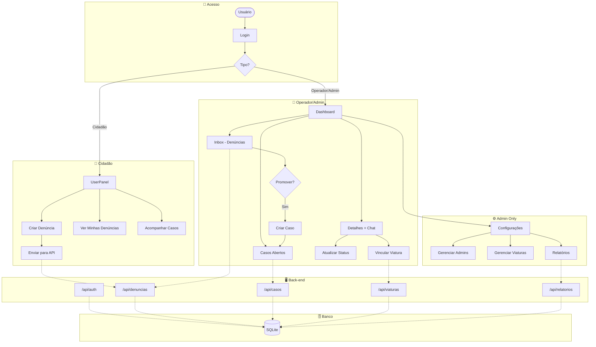

# 🔄 Diagrama de Fluxo do Sistema

## Fluxo Geral

---

## 📝 Resumo do Fluxo

### 1. Autenticação
- Usuário faz login → JWT Token gerado
- Redirecionamento baseado no tipo de usuário

### 2. Cidadão
- Cria denúncias (anônimas ou identificadas)
- Visualiza suas denúncias
- Acompanha casos e conversa com operador

### 3. Operador
- Visualiza denúncias pendentes (Inbox)
- Promove denúncias para casos
- Gerencia casos e envia mensagens via chat
- Vincula/desvincula viaturas aos casos
- Finaliza casos (libera viatura automaticamente)

### 4. Administrador
- Todas as funções do operador
- Gerencia outros administradores
- CRUD de viaturas
- Acessa relatórios e estatísticas

---

## 🔗 Principais Endpoints

| Módulo | Endpoints |
|--------|-----------|
| Auth | `POST /login` |
| Denúncias | `GET, POST, PUT, DELETE` |
| Casos | `GET, PUT, POST /{id}/mensagens, POST /{id}/vincular-viatura, POST /{id}/finalizar` |
| Viaturas | `GET, POST, PUT, DELETE, GET /disponiveis` |
| Relatórios | `GET /dashboard, GET /casos-por-status, GET /casos-por-tipo` |
